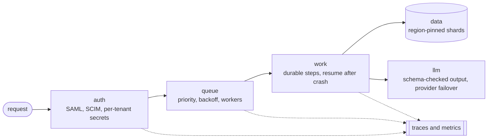

<picture>
  <source media="(prefers-color-scheme: dark)" srcset="https://raw.githubusercontent.com/sudhanshu1402/sudhanshu1402/main/assets/hero-dark.svg" />
  <source media="(prefers-color-scheme: light)" srcset="https://raw.githubusercontent.com/sudhanshu1402/sudhanshu1402/main/assets/hero-light.svg" />
  
</picture>

<samp>
  <a href="https://sudhanshu1402.github.io">portfolio</a> &nbsp;.&nbsp;
  <a href="https://sudhanshu1402.github.io/system-design-portal/">system design</a> &nbsp;.&nbsp;
  <a href="https://www.linkedin.com/in/sudhanshusingh1402/">linkedin</a> &nbsp;.&nbsp;
  <a href="https://www.npmjs.com/package/@sudhanshu1402/keel">npm</a>
</samp>

Backend infrastructure in TypeScript. I care more about a system staying correct after it crashes than about it looking clever before it does, and everything below is built around that one idea.

Backend Engineer, Mumbai. Started in data analysis at Policybazaar, which is where the systems questions got interesting: why a pipeline stalls, where records go missing, what happens under load. **Open to backend and platform engineering roles.**

<table>
<tr>
<td><a href="https://github.com/sudhanshu1402/keel"><picture><source media="(prefers-color-scheme: dark)" srcset="https://raw.githubusercontent.com/sudhanshu1402/sudhanshu1402/main/assets/card-keel-dark.svg" /><source media="(prefers-color-scheme: light)" srcset="https://raw.githubusercontent.com/sudhanshu1402/sudhanshu1402/main/assets/card-keel-light.svg" /></picture></a></td>
<td><a href="https://github.com/sudhanshu1402/nocap"><picture><source media="(prefers-color-scheme: dark)" srcset="https://raw.githubusercontent.com/sudhanshu1402/sudhanshu1402/main/assets/card-nocap-dark.svg" /><source media="(prefers-color-scheme: light)" srcset="https://raw.githubusercontent.com/sudhanshu1402/sudhanshu1402/main/assets/card-nocap-light.svg" /></picture></a></td>
<td><a href="https://github.com/sudhanshu1402/receipts"><picture><source media="(prefers-color-scheme: dark)" srcset="https://raw.githubusercontent.com/sudhanshu1402/sudhanshu1402/main/assets/card-receipts-dark.svg" /><source media="(prefers-color-scheme: light)" srcset="https://raw.githubusercontent.com/sudhanshu1402/sudhanshu1402/main/assets/card-receipts-light.svg" /></picture></a></td>
</tr>
<tr>
<td><a href="https://github.com/sudhanshu1402/enterprise-auth-stack"><picture><source media="(prefers-color-scheme: dark)" srcset="https://raw.githubusercontent.com/sudhanshu1402/sudhanshu1402/main/assets/card-auth-dark.svg" /><source media="(prefers-color-scheme: light)" srcset="https://raw.githubusercontent.com/sudhanshu1402/sudhanshu1402/main/assets/card-auth-light.svg" /></picture></a></td>
<td><a href="https://github.com/sudhanshu1402/distributed-queue-engine"><picture><source media="(prefers-color-scheme: dark)" srcset="https://raw.githubusercontent.com/sudhanshu1402/sudhanshu1402/main/assets/card-queue-dark.svg" /><source media="(prefers-color-scheme: light)" srcset="https://raw.githubusercontent.com/sudhanshu1402/sudhanshu1402/main/assets/card-queue-light.svg" /></picture></a></td>
<td><a href="https://github.com/sudhanshu1402/multi-region-mongo-patterns"><picture><source media="(prefers-color-scheme: dark)" srcset="https://raw.githubusercontent.com/sudhanshu1402/sudhanshu1402/main/assets/card-mongo-dark.svg" /><source media="(prefers-color-scheme: light)" srcset="https://raw.githubusercontent.com/sudhanshu1402/sudhanshu1402/main/assets/card-mongo-light.svg" /></picture></a></td>
</tr>
<tr>
<td><a href="https://github.com/sudhanshu1402/llm-assessment-pipeline"><picture><source media="(prefers-color-scheme: dark)" srcset="https://raw.githubusercontent.com/sudhanshu1402/sudhanshu1402/main/assets/card-llm-dark.svg" /><source media="(prefers-color-scheme: light)" srcset="https://raw.githubusercontent.com/sudhanshu1402/sudhanshu1402/main/assets/card-llm-light.svg" /></picture></a></td>
<td><a href="https://github.com/sudhanshu1402/otel-sdk-node"><picture><source media="(prefers-color-scheme: dark)" srcset="https://raw.githubusercontent.com/sudhanshu1402/sudhanshu1402/main/assets/card-otel-dark.svg" /><source media="(prefers-color-scheme: light)" srcset="https://raw.githubusercontent.com/sudhanshu1402/sudhanshu1402/main/assets/card-otel-light.svg" /></picture></a></td>
<td><a href="https://github.com/sudhanshu1402/system-design-portal"><picture><source media="(prefers-color-scheme: dark)" srcset="https://raw.githubusercontent.com/sudhanshu1402/sudhanshu1402/main/assets/card-portal-dark.svg" /><source media="(prefers-color-scheme: light)" srcset="https://raw.githubusercontent.com/sudhanshu1402/sudhanshu1402/main/assets/card-portal-light.svg" /></picture></a></td>
</tr>
</table>

  

<picture>
  <source media="(prefers-color-scheme: dark)" srcset="https://raw.githubusercontent.com/sudhanshu1402/sudhanshu1402/main/assets/tech-dark.svg" />
  <source media="(prefers-color-scheme: light)" srcset="https://raw.githubusercontent.com/sudhanshu1402/sudhanshu1402/main/assets/tech-light.svg" />
  
</picture>

## keel

Work is written as named steps. When a step finishes its result is journaled, so a process that dies at step 7 resumes at step 7 instead of starting over. Same idea as Temporal or Vercel Workflow, without the server, the database or the build step.

Run 1 charges a card and dies before shipping. Run 2 resumes and ships, and the card is charged once.

<picture>
  <source media="(prefers-color-scheme: dark)" srcset="https://raw.githubusercontent.com/sudhanshu1402/sudhanshu1402/main/assets/bench-dark.svg" />
  <source media="(prefers-color-scheme: light)" srcset="https://raw.githubusercontent.com/sudhanshu1402/sudhanshu1402/main/assets/bench-light.svg" />
  
</picture>

The 91 is the honest number, and the gap is three decades wide. `FileStore` rewrites and fsyncs the whole file on every commit, so the 5,000th step costs far more than the first. It is the default because it needs nothing installed, not because it is fast. [Benchmark notes](https://github.com/sudhanshu1402/keel/blob/main/docs/BENCHMARKS.md).

## nocap

A terminal UI for Claude Code that reads in plain English and stops before anything irreversible. Eight non-destructive tools run without asking. Everything else is classified and held at this card, and the border color is the risk level:

The gate runs on the SDK's real permission system, so it is not a confirmation dialog painted on top of a decision that already happened. [What it does and does not cover](https://github.com/sudhanshu1402/nocap#safety).

## receipts

An agent says the tests pass. `receipts` reads the session transcript and checks whether anything actually ran.

Claims are matched against the tool calls in the window that produced them, so a passing test suite has to exist in the transcript before "tests pass" is accepted. Runs as a CLI or a Claude Code plugin.

<h2>How the repos fit together</h2>

Every box below except `request` is a separate repo. They aren't one deployed platform. Each takes a single segment of an ordinary request path and isolates the way that segment fails.

Reference implementations, not production deployments. Each README says what it is and what it isn't. The failure mode in the second column is what each one is actually for.

| Repo | The problem it exists to handle |
| :-- | :-- |
| **[enterprise-auth-stack](https://github.com/sudhanshu1402/enterprise-auth-stack)** [write-up](https://sudhanshu1402.github.io/system-design-portal/auth-stack/) | A cached SAML strategy keeps failing after a certificate rotation until something evicts it. Rebuilding per request costs a Secrets Manager call and makes rotation take effect immediately. |
| **[distributed-queue-engine](https://github.com/sudhanshu1402/distributed-queue-engine)** [write-up](https://sudhanshu1402.github.io/system-design-portal/queue-engine/) | The queue key is `{emails}:outbound`. That hash tag pins every key for the queue to one Redis Cluster slot, which is what BullMQ's multi-key Lua scripts need if you ever move off a single node. |
| **[multi-region-mongo-patterns](https://github.com/sudhanshu1402/multi-region-mongo-patterns)** [write-up](https://sudhanshu1402.github.io/system-design-portal/mongo-sharding/) | `POST /users` returns 409 when a user's region doesn't match its tenant's zone. A record physically can't land in a zone that violates its tenant's residency. |
| **[otel-sdk-node](https://github.com/sudhanshu1402/otel-sdk-node)** [write-up](https://sudhanshu1402.github.io/system-design-portal/tracing-sdk/) | Auto-instrumentation patches modules on `require`, so anything imported before `sdk.start()` is never patched and its spans silently vanish. That's the bug people lose an afternoon to. |
| **[llm-assessment-pipeline](https://github.com/sudhanshu1402/llm-assessment-pipeline)** [write-up](https://sudhanshu1402.github.io/system-design-portal/llm-pipeline/) | The model will occasionally emit zero correct options, or three. A Zod refinement enforces exactly one, and a violation is rejected before anything is stored. |

<h2>On npm</h2>

| Package | What it is |
| :-- | :-- |
| **[keel](https://www.npmjs.com/package/@sudhanshu1402/keel)** | Durable execution for TypeScript. Zero runtime dependencies. CI runs the suite on Node 20 and 22, and the SQLite store has its own gate. |
| **[nocap](https://www.npmjs.com/package/@sudhanshu1402/nocap)** | A plain-English terminal UI for Claude Code: a readable feed of what it's doing, and a Yes/No gate before anything risky, on the real permission system. |
| **[receipts](https://www.npmjs.com/package/@sudhanshu1402/receipts)** | Reads a Claude Code transcript and checks each claim against the tool calls behind it. Zero dependencies. |

All three are early. Each ships from CI only when the version in `package.json` changes.

<h2>How I work</h2>

 

- I reach for the boring, well-understood tool first. Novelty is a cost you pay at 3am.
- I like problems that only show up under failure: retries, partial writes, a process that dies mid-transaction. That's usually where the real design is.
- I write the runbook and the traces before I call something done. If I can't see what a system is doing, I don't trust it.

<h2>Activity</h2>

 

<picture>
  <source media="(prefers-color-scheme: dark)" srcset="https://raw.githubusercontent.com/sudhanshu1402/sudhanshu1402/output/github-contribution-grid-snake-dark.svg" />
  <source media="(prefers-color-scheme: light)" srcset="https://raw.githubusercontent.com/sudhanshu1402/sudhanshu1402/output/github-contribution-grid-snake.svg" />
  
</picture>

 
<samp>
  <a href="https://sudhanshu1402.github.io">portfolio</a> &nbsp;.&nbsp;
  <a href="https://sudhanshu1402.github.io/system-design-portal/">system design</a> &nbsp;.&nbsp;
  <a href="https://www.linkedin.com/in/sudhanshusingh1402/">linkedin</a>
</samp>

