

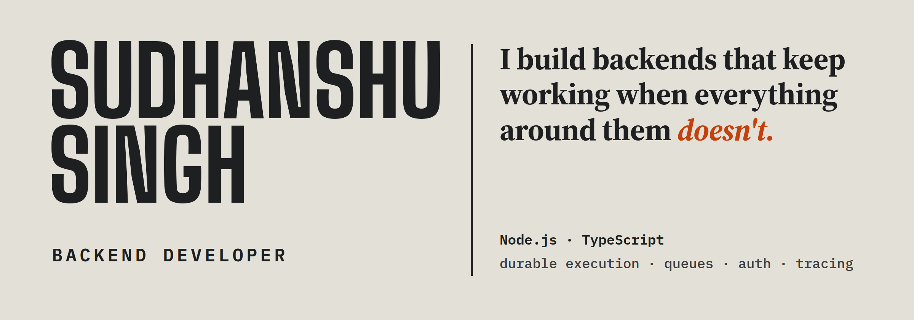

<a href="https://sudhanshu1402.github.io"><b>Portfolio</b></a> &nbsp;·&nbsp;
<a href="https://sudhanshu1402.github.io/system-design-portal/"><b>System design</b></a> &nbsp;·&nbsp;
<a href="https://www.linkedin.com/in/sudhanshusingh1402/"><b>LinkedIn</b></a> &nbsp;·&nbsp;
<a href="https://www.npmjs.com/~sudhanshu1402"><b>npm</b></a>

 

## Projects

Each one exists for a single failure, and each tells its story in its own format. Three ship on npm. The rest are reference implementations, not production systems, and every README says what it isn't.

 

<table>
<tr>
<td width="50%" valign="top">
<a href="https://github.com/sudhanshu1402/keel">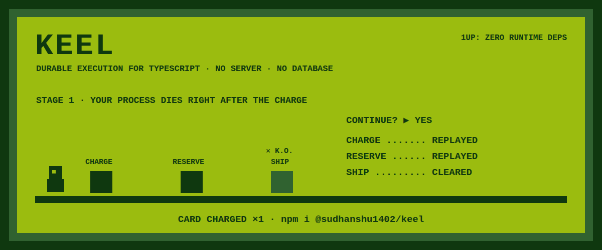</a>

<b><a href="https://github.com/sudhanshu1402/keel">keel</a></b> Durable execution for TypeScript. A crashed run resumes where it died.

</td>
<td width="50%" valign="top">
<a href="https://github.com/sudhanshu1402/receipts">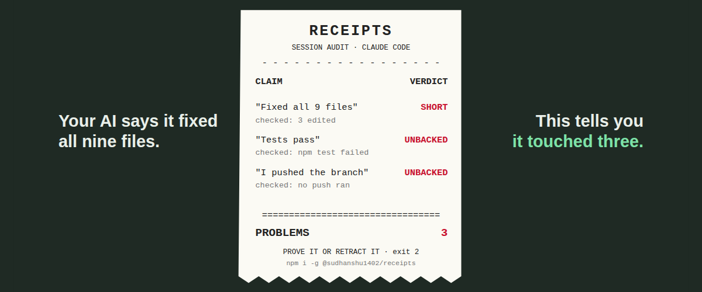</a>

<b><a href="https://github.com/sudhanshu1402/receipts">receipts</a></b> Checks what an AI agent claimed against what actually ran.

</td>
</tr>
<tr>
<td width="50%" valign="top">
<a href="https://github.com/sudhanshu1402/nocap">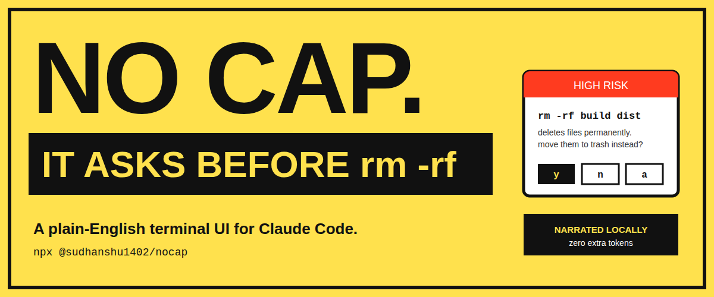</a>

<b><a href="https://github.com/sudhanshu1402/nocap">nocap</a></b> A plain-English terminal UI for Claude Code that asks before anything risky.

</td>
<td width="50%" valign="top">
<a href="https://github.com/sudhanshu1402/distributed-queue-engine">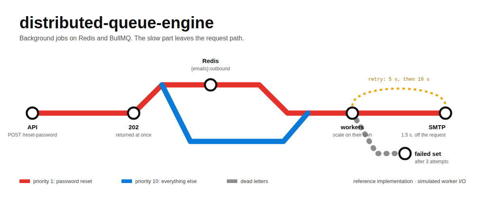</a>

<b><a href="https://github.com/sudhanshu1402/distributed-queue-engine">distributed-queue-engine</a></b> Background jobs on Redis and BullMQ, off the request path.

</td>
</tr>
<tr>
<td width="50%" valign="top">
<a href="https://github.com/sudhanshu1402/enterprise-auth-stack">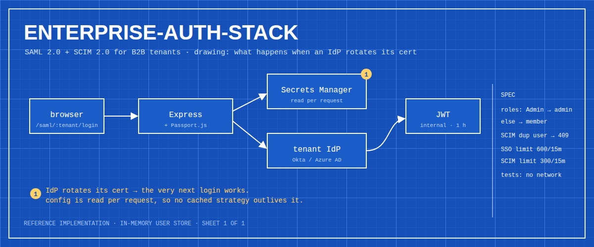</a>

<b><a href="https://github.com/sudhanshu1402/enterprise-auth-stack">enterprise-auth-stack</a></b> SAML and SCIM for B2B tenants. A rotated cert works on the next login.

</td>
<td width="50%" valign="top">
<a href="https://github.com/sudhanshu1402/multi-region-mongo-patterns">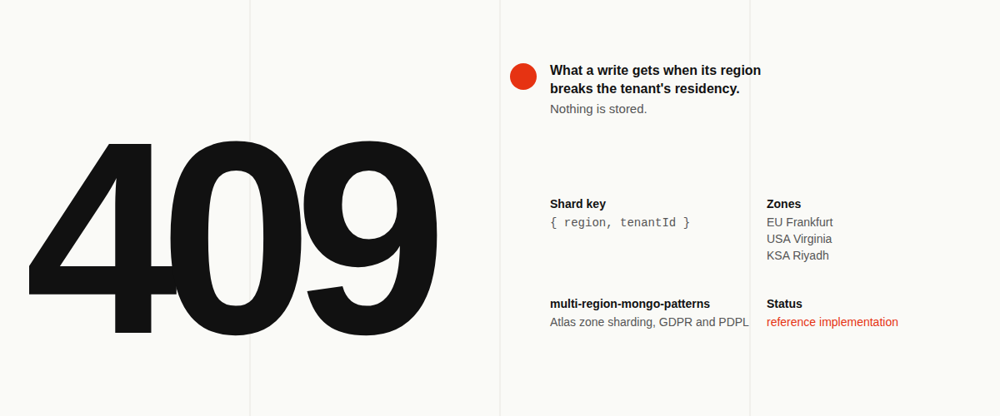</a>

<b><a href="https://github.com/sudhanshu1402/multi-region-mongo-patterns">multi-region-mongo-patterns</a></b> Zone sharding for data residency. The wrong region gets a 409.

</td>
</tr>
<tr>
<td width="50%" valign="top">
<a href="https://github.com/sudhanshu1402/llm-assessment-pipeline">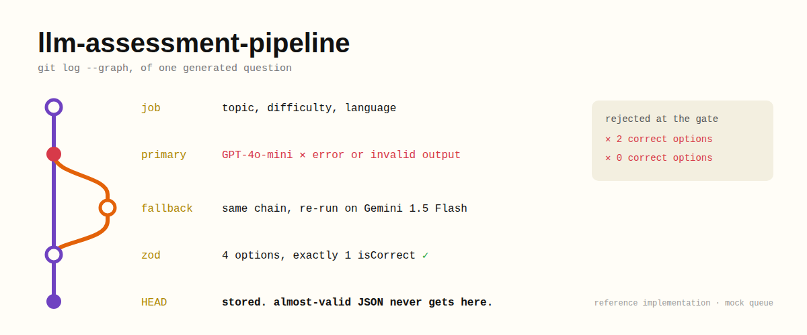</a>

<b><a href="https://github.com/sudhanshu1402/llm-assessment-pipeline">llm-assessment-pipeline</a></b> Schema-checked LLM output with provider failover.

</td>
<td width="50%" valign="top">
<a href="https://github.com/sudhanshu1402/otel-sdk-node">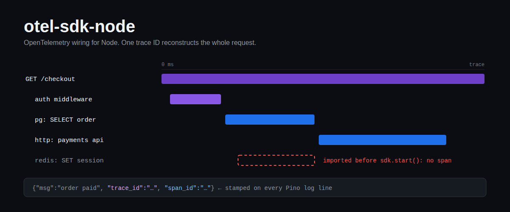</a>

<b><a href="https://github.com/sudhanshu1402/otel-sdk-node">otel-sdk-node</a></b> OpenTelemetry wiring for Node. Every log line carries its trace.

</td>
</tr>
<tr>
<td width="50%" valign="top">
<a href="https://github.com/sudhanshu1402/system-design-portal">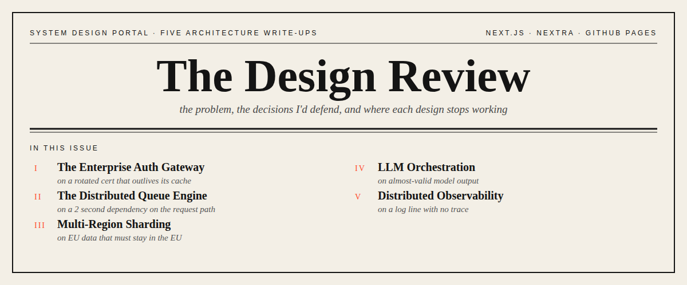</a>

<b><a href="https://github.com/sudhanshu1402/system-design-portal">system-design-portal</a></b> Five architecture write-ups: the decisions, and where each design stops working.

</td>
<td width="50%" valign="top">
<a href="https://github.com/sudhanshu1402/engineering-projects">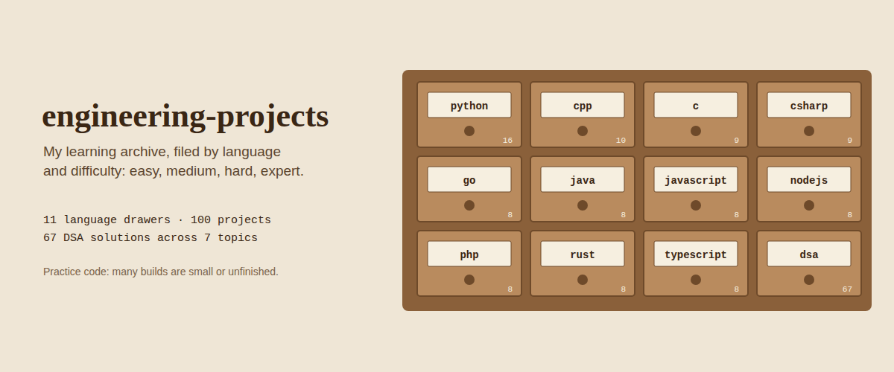</a>

<b><a href="https://github.com/sudhanshu1402/engineering-projects">engineering-projects</a></b> My learning archive, filed by language and difficulty.

</td>
</tr>
</table>

 

Also on GitHub: [social-share-cards](https://github.com/sudhanshu1402/social-share-cards) (the repo preview cards), [hackathons-and-challenges](https://github.com/sudhanshu1402/hackathons-and-challenges) (hiring tests and one hackathon, as submitted), [classroom-emotion-recognition](https://github.com/sudhanshu1402/classroom-emotion-recognition) (a college prototype).

 

## How I work

- **Boring tools first.** Novelty is a cost you pay at 3am.
- **Design for the failure.** Retries, partial writes, a process dying mid-transaction. That's usually where the real design is.
- **If I can't see it, I don't trust it.** The runbook and the traces come before "done".

 

**Backend developer, Node.js and TypeScript.** Started in data analysis at Policybazaar, now building backend infrastructure.

